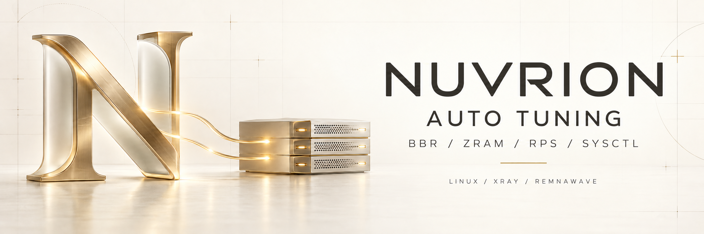

<div align="center">



# Nuvrion Auto Tuning

### Настройка сети, памяти и защиты Linux-сервера


[](https://github.com/nuvrion-kvn/Nuvrion-Auto-Tuning/actions/workflows/validate.yml)
[](LICENSE)
[](#-совместимость)
[](#-совместимость)

**BBR · fq · ZRAM · sysctl · Conntrack · Remnawave · Fail2ban · Diagnostics**

</div>

## Назначение

**Nuvrion Auto Tuning 1.0.0** подготавливает Linux-сервер к работе с Xray и Remnawave: оценивает CPU, память и состояние системы, рассчитывает сетевые параметры и проверяет результат после применения.

Один запуск объединяет настройку BBR, conntrack и ZRAM, проверку лимитов ноды, аудит SSH и firewall, обслуживание диска и сертификатов. Перед изменениями скрипт показывает план, запрашивает согласие и сохраняет снимки настроек. Повторный запуск выполняет диагностику и необходимые исправления.

Xray и панель Remnawave устанавливаются отдельно. Итоговый отчёт различает готовые компоненты, предупреждения и состояния, требующие ручного действия или перезагрузки.

## Схема работы


[Открыть подробную схему в полном размере](assets/auto-scheme.svg)

## Быстрый запуск

Запустите от `root`:

```bash
bash <(curl -fsSL https://raw.githubusercontent.com/nuvrion-kvn/Nuvrion-Auto-Tuning/main/nuvrion-auto-tuning.sh)
```

Перед изменением системы скрипт показывает план и запрашивает подтверждение. Обозначения в интерактивных вопросах: `Д` — да, `Н` — нет, `П` — пропустить.

> [!IMPORTANT]
> Скрипт меняет параметры ядра, сети, swap и защиты сервера. Перед первым запуском на критической системе подготовьте snapshot или проверенную резервную копию.

## Что делает скрипт

| Раздел | Возможности |
|---|---|
| Сеть | BBR, `fq`, TCP/UDP buffers, backlog, MTU probing и диапазон локальных портов |
| Conntrack | адаптивный лимит, hash buckets, контроль загрузки таблицы |
| ZRAM | поиск, восстановление и установка ZRAM, выбор размера, алгоритма и приоритета |
| Remnawave/Xray | поиск контейнера ноды, NOFILE, network namespace, API-порт и системные лимиты |
| Защита | kernel hardening, SSH-аудит, Fail2ban, UFW/nftables, Docker socket и публичные порты |
| Обслуживание | security updates, NTP, TRIM, диск, inode, сертификаты и проверка после reboot |

Настройки рассчитываются по ресурсам и фактическому состоянию сервера. Повторный запуск поддерживается: скрипт снова выполняет диагностику и применяет только необходимые исправления.

## Совместимость

| Система | Статус |
|---|:---:|
| Ubuntu 22.04 LTS | ✅ Поддерживается |
| Ubuntu 24.04 LTS | ✅ Основная платформа |
| Debian 12 | ✅ Поддерживается |
| x86_64 / amd64 | ✅ Поддерживается |
| arm64 / aarch64 | ✅ Поддерживается |
| KVM/VPS и выделенный сервер | ✅ |
| Xray / Remnawave Node | ✅ |

Другие Debian-based системы требуют отдельной проверки.

## Переменные автоматизации

| Переменная | Назначение |
|---|---|
| `NUVRION_ASSUME_YES=1` | пропустить стартовое подтверждение |
| `NUVRION_SECURITY=0` | отключить блок безопасности |
| `NUVRION_ENABLE_UFW=1/0` | включить или пропустить настройку UFW |
| `NUVRION_PANEL_IPS="IP/CIDR"` | адреса панели Remnawave для доступа к API ноды |
| `NUVRION_PANEL_PORT=2222` | API-порт Remnawave Node |
| `NUVRION_FIREWALL_PORTS="tcp:443"` | дополнительные публичные порты |
| `NUVRION_HARDEN_SSH=1` | включить key-only SSH при наличии `authorized_keys` |
| `NUVRION_INSTALL_ZRAM_PACKAGES=0` | не устанавливать пакеты ZRAM |
| `NUVRION_INSTALL_ZRAM_MODULES=1/0` | установить или пропустить `linux-modules-extra` без вопроса |
| `NUVRION_SYSTEM_MAINTENANCE=0` | отключить системное обслуживание |
| `NUVRION_CERTIFICATES=0` | отключить аудит сертификатов |
| `NUVRION_POST_REBOOT_CHECK=0` | не создавать проверку после перезагрузки |

Пример автоматического запуска:

```bash
NUVRION_ASSUME_YES=1 \
bash <(curl -fsSL https://raw.githubusercontent.com/nuvrion-kvn/Nuvrion-Auto-Tuning/main/nuvrion-auto-tuning.sh)
```

## Диагностика

В конце скрипт показывает контрольные результаты по sysctl, BBR/qdisc, conntrack, ZRAM, Remnawave Node, firewall и службам. Если требуется перезагрузка, одноразовая проверка сохраняет результат в:

```text
/var/lib/nuvrion-tuning/post-reboot-last.txt
```

## Безопасность

- Секретные значения не нужно передавать в Issues или публичные логи.
- SSH hardening включается только отдельной переменной и после проверки ключей.
- Скрипт не добавляет SSH-ключи.
- При конфликте с существующей системой firewall выводится предупреждение или остановка.
- Внешние проекты и пакеты сохраняют собственные лицензии.

Подробнее: [SECURITY.md](SECURITY.md) и [THIRD_PARTY_NOTICES.md](THIRD_PARTY_NOTICES.md).

## Автор и лицензия

**Nuvrion**  
GitHub: **nuvrion-kvn**  

Оригинальный код Nuvrion распространяется по лицензии [MIT](LICENSE).
